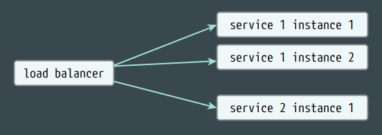
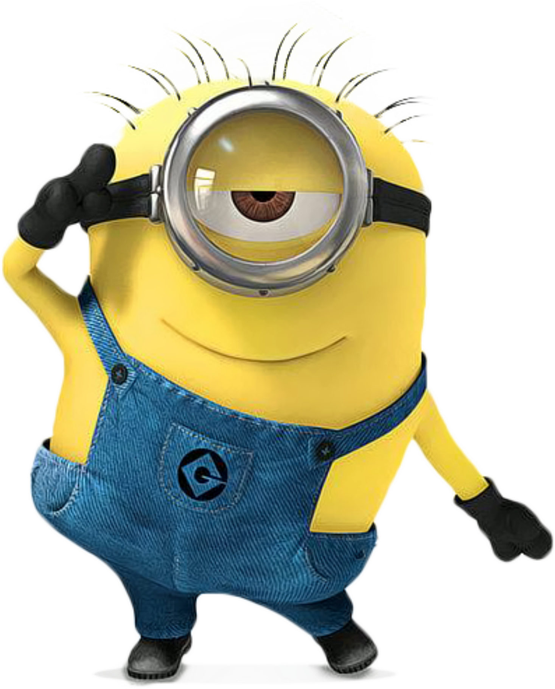

# Presentation Title

A subtitle statement

 
<small>rev. 2021-07-15</small>

---

## Intro

This is an introductory material into someTopic theory, 
providing an overview of the main concepts and capabilities 
promoted by this approach for designing and running solutions.

  
It will be extended to become a workshop 
with practical exercises for {TBD}.

===

### Formatting Conventions

The following typographical conventions are used in this material:

- _italic text_
  - for slightly calling attention to some parts of the text
- **highlighted text**
  - for strongly emphasizing key concepts, ideas, or aspects
- `monospaced text`
  - for showing code or command line elements
- and blockquotes:
  > for text that is quoted from another source, 
  > or for highlighting a statement or section

---

## Main Topic

One of the **many** definitions of it states that:

> - quote line 1
> - quote line 2
> - quote line 3

---

### Lorem Ipsum

- It is simply dummy text of the printing and typesetting industry.
  - It has been the since the 1500s, when an unknown printer took a galley of type and scrambled it to make a type specimen book.
  - It has survived not only five centuries, but also the leap into electronic typesetting, remaining essentially unchanged.
    
      <!-- .element: class="fragment" data-fragment-index="1" height="40%" width="40%" -->

> Another quote or highlight section.

---

  

## Thanks a minion for watching!

<!-- .element height="50%" width="30%" -->
